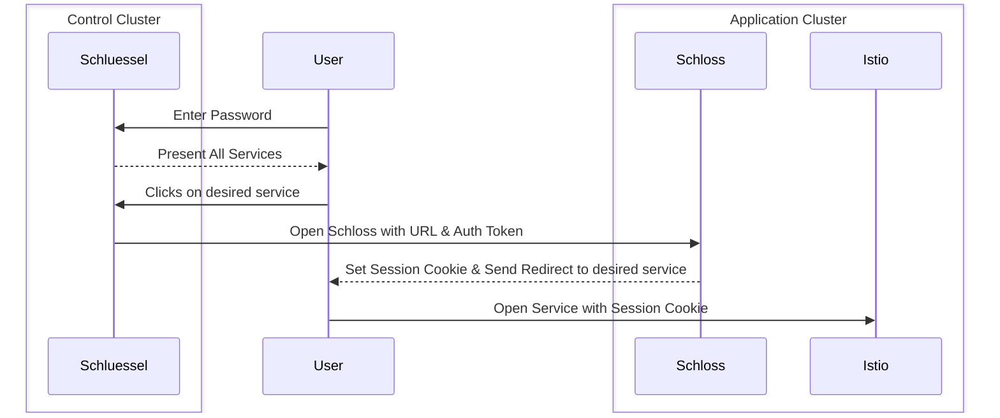
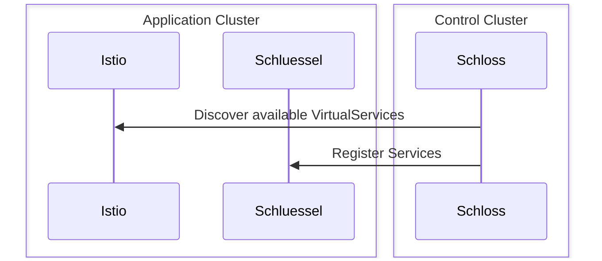

# Schloss 🔒
Schloss is a service that automatically discovers Virtual Services within its own domain or subdomains, specifically on the same cluster where it is deployed, and then registers them with the complementary Schluessel service.

When Schluessel receives the correct pre-shared key from user interaction, along with a specified service, Schloss generates a 24-hour authentication cookie in the user's browser. This cookie enables the user to authenticate against Istio and obtain access to the associated services. Once the cookie is created, the user is seamlessly redirected to the respective service.

## Important
It's important to note that Schloss & Schluessel primarily serve as a means to hide resources from crawlers and prevent accidental access. They do not offer robust security akin to a simple password protection. If you have higher security requirements, it is strongly recommended to reinforce the security of your services and consider implementing a dedicated authentication proxy such as OAuth2-proxy.

## About Schloss & Schluessel 🔐
Schloss and Schluessel are two complementary services. Schluessel serves as the user's entry point, allowing them to log in and access all the services registered by Schloss instances across different clusters.

Schloss & Schluessel aim to utilize the features of Istio while minimizing the added complexity of OAuth and user management, without requiring modifications to the services. It's important to note that Schloss & Schluessel do not provide robust security for your services. They simply provide a level of authentication that may be considered weak.

The user flow is as follows:



The service autodiscovery operates as follows:



### Environment Variables

Environment variables can be configured in the docker-compose.yml file or Helms values.yaml.

| Variable | Default | Description |
| --- | --- | --- |
| DOMAIN | ```.127.0.0.1``` | The domain for which the Cookie should be valid. |
| SERVICES | ```[["Service1", "http://127.0.0.1:8081"],["Service2", "http://127.0.0.1:8081"]]``` | A list of tuples which represent the Services which should be sent to the Schluessel service. |
| TOKEN_NAME | ```test_auth_token``` | The Auth Cookie Key. |
| TOKEN_VALUE | ```abcdefgh1234``` | (Secret) The Auth Cookie Value. |
| SCHLUESSEL_ENDPOINT | ```http://127.0.0.1:8080/register``` | The address of Schluessels register API. |
| SHARED_SECRET | ```shared_secret``` | The shared secret Schluessel authenticates against Schloss |
| HTTP_HOST | ```127.0.0.1``` | The host of the default bind address. |
| HTTP_PORT | ```8080``` | The port of the default bind address. |

### API

| Method | Endpoint | Description |
| --- | --- | --- |
| GET | / | Returns a basic home page with "This is Schloss 🔒" heading. This is for development purpose. |
| POST | /generate_auth_cookie | Generates an auth cookie and redirects to a service URL. Accepts a JSON body with shared_secret and service_url fields. Returns a 302 redirect response with the auth cookie or a 401 Unauthorized response. |

## How to run it

### Locally for development purpose
The reommended method of running Schloss locally is by utilizing docker-compose.

Schloss can be run locally by utilizing the provided ```local.yaml``` via ```docker compose -f local.yaml up```. Afterwards there are available:
- A Schluessel under http://127.0.0.1:8080
- A Schloss under http://127.0.0.1:8081
- A Schloss under http://127.0.0.1:8082

After authenticating on Schluessel the user can open one of the services and check in the browser if the auth cookie was successfully set.

You can also run Schloss und Schluessel locally via ```cargo run`` but this is much more complex.

### In a k8s Cluster
For running schloss productively you need knowledge of Helm, Kubernetes and Istio. Ideally Schluessel is hosted on a different Cluster than Schloss. Both services can be installed via their respective Helm charts under ```deploy/helm```. Before doing so please modify the values.yaml to fit your needs.

If you utilize Istio for authentication as recommended then please take into account that you need to create VirtualServices to protect your resources via cookie matching.

An example for such a VirtualService could look like this:
```yaml
apiVersion: networking.istio.io/v1alpha3
kind: VirtualService
metadata:
  name: cookie-vs-example
spec:
  hosts:
  - "*"
  gateways:
  - my-gateway
  http:
  - match:
    - uri:
        prefix: /
      headers:
        cookie:
          regex: ^(.\*?;)?(token_name=token_value)(;.\*)?$
    route:
    - destination:
        host: protected-service
```